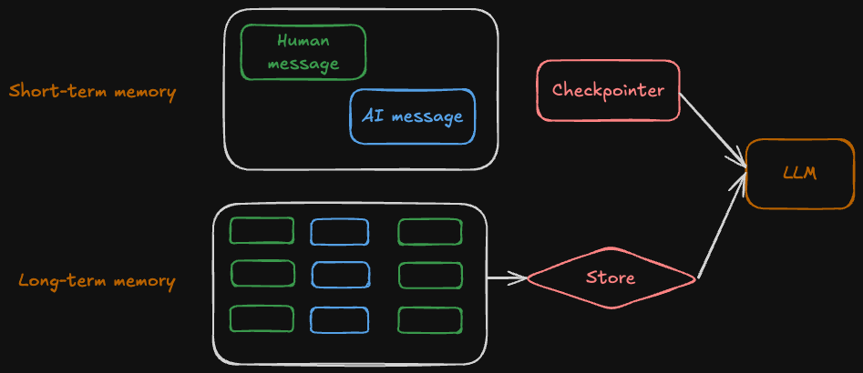

Memory lets AI agents remember past interactions so they can learn, adapt to user preferences, and work more efficiently. As tasks and conversations get more complex, this becomes essential for a smoother and more satisfying user experience.

There are mainly two types of memory



## Short-term memory

Short-term memory in LangGraph lets an application remember interactions within a single conversation thread by storing conversation history and other state (like files or retrieved documents) in thread-scoped checkpoints. While this gives the bot full context for each thread, long histories can exceed an LLM’s context window, slow responses, increase cost, and reduce accuracy. Because chat messages accumulate over time, applications often need strategies to trim or forget stale information to keep the context efficient and relevant.

A few techniques for managing short-term memory include:
- **Trim Messages**: Keep only the most recent messages (or tokens) so the history fits within the model’s context window.

- **Delete Messages**: Explicitly remove specific messages or wipe the entire history when it becomes irrelevant.

- **Summarize History**: Convert older messages into a compact summary; keep the summary + latest messages to preserve context while saving tokens.

- **Use Checkpoints**: Store, inspect, or delete conversation checkpoints to control state over time (not for token reduction, but for thread management).

- **Custom Filtering**: Apply your own logic (e.g., drop tool messages, remove low-value content) before trimming or summarizing.


## Long-term memory

Short-term memory in LangGraph lets stores user specific or application level data across sessions and is shared across conversational threads. Memories are scoped to any custom namespace, more than just single thread id. Long-term memory allows an application to retain information **across sessions** and **across conversation threads**.

A few key techniques and considerations for managing long-term memory include:

- **Memory type**: Decide what kind of information you want to store:  
  - **Semantic** – facts or knowledge from past interactions (e.g., user prefers short answers).  
  - **Episodic** – experiences or past actions (e.g., few-shot example prompting, agent previously handled this task).  
  - **Procedural** – instructions or rules, a combination of model weights, agent code, and agent’s prompt that collectively determine the agent’s functionality (e.g., how the agent should update prompts).  

- **Memory update timing**: Choose between immediate or deferred writes:  
  - **Real-Time Updates**: Memory is written synchronously during the interaction; ensures immediate availability but can slow responses.  
  - **Background Updates**: Memory is written asynchronously to avoid latency but may not be available immediately.

- **Memory storage structure**: Long-term memory is stored in a ***store*** using namespaces (e.g., user ID + app context) and keys (unique per memory item). Common patterns include:  
  - **Profile approach**: Maintain a single document per user that accumulates structured facts.  
  - **Collection approach**: Store many small, discrete memory items for modular retrieval (e.g., each fact as its own document).


## Examples

### Short-term Memory Example

Short-term memory uses checkpointers to save conversation state within a single thread. Here's how to implement it:

```python
from langgraph.graph import StateGraph, START, END
from langgraph.checkpoint.memory import InMemorySaver
from langchain_core.runnables import RunnableConfig
from typing import Annotated
from typing_extensions import TypedDict
from operator import add
from IPython.display import Image, display

# State schema: 'add' reducer accumulates list values across invocations
class State(TypedDict):
    foo: str
    bar: Annotated[list[str], add]

def node_a(state: State):
    return {"foo": "a", "bar": ["a"]}

def node_b(state: State):
    return {"foo": "b", "bar": ["b"]}

# Build graph: START -> node_a -> node_b -> END
workflow = StateGraph(State)
workflow.add_node("node_a", node_a)
workflow.add_node("node_b", node_b)
workflow.add_edge(START, "node_a")
workflow.add_edge("node_a", "node_b")
workflow.add_edge("node_b", END)

# Checkpointer enables memory - state persists across invocations
checkpointer = InMemorySaver()
graph = workflow.compile(checkpointer=checkpointer)

display(Image(graph.get_graph().draw_mermaid_png()))

# Each thread_id maintains separate memory
config: RunnableConfig = {"configurable": {"thread_id": "1"}}

print("=== First Invocation (Thread 1) ===")
result1 = graph.invoke({"foo": "", "bar": []}, config)
print(f"Result: {result1}")

print("\n=== Second Invocation (Thread 1) ===")
# Memory persists: bar accumulates previous values
result2 = graph.invoke({"foo": "", "bar": []}, config)
print(f"Result: {result2}")

print("\n=== Different Thread (Thread 2 - separate memory) ===")
# Thread 2 has independent state - doesn't affect thread 1
config2: RunnableConfig = {"configurable": {"thread_id": "2"}}
result4 = graph.invoke({"foo": "", "bar": []}, config2)
print(f"Result: {result4}")
state2 = graph.get_state(config2)
print(f"State: {state2.values}")

print("\n=== Third Invocation (Thread 1) ===")
# Thread 1's state preserved even after thread 2 ran
result3 = graph.invoke({"foo": "", "bar": []}, config)
print(f"Result: {result3}")
```

Output
```
=== First Invocation (Thread 1) ===
Result: {'foo': 'b', 'bar': ['a', 'b']}

=== Second Invocation (Thread 1) ===
Result: {'foo': 'b', 'bar': ['a', 'b', 'a', 'b']}

=== Different Thread (Thread 2 - separate memory) ===
Result: {'foo': 'b', 'bar': ['a', 'b']}
State: {'foo': 'b', 'bar': ['a', 'b']}

=== Third Invocation (Thread 1) ===
Result: {'foo': 'b', 'bar': ['a', 'b', 'a', 'b', 'a', 'b']}
```

### Long-term Memory Example

Long-term memory in LangGraph uses a memory store to persist information across sessions and threads. The following examples demonstrate core operations with three separate scenarios.

#### Setup

First, we'll set up the memory store and configuration that will be used across all examples:

```python
from langgraph.store.memory import InMemoryStore
from langgraph.checkpoint.memory import InMemorySaver
from langgraph.graph import MessagesState, StateGraph, START, END
from langchain_core.runnables import RunnableConfig
from langgraph.store.base import BaseStore
from langchain_core.messages import HumanMessage, AIMessage

# Configuration Constants
USER_ID_1 = "user-1"
USER_ID_2 = "user-2"
THREAD_ID_1 = "thread-1"
THREAD_ID_2 = "thread-2"
APPLICATION_CONTEXT = "chat-preferences"

PREFERENCES_KEY = "preferences"
FOOD_KEY = "food"
LOCATION_KEY = "location"

# Initialize Memory Store
memory_store = InMemoryStore()

# Create namespaces for users
user_namespace_1 = (USER_ID_1, APPLICATION_CONTEXT)
user_namespace_2 = (USER_ID_2, APPLICATION_CONTEXT)

# Define memory node function
def use_memory(state: MessagesState, config: RunnableConfig, *, store: BaseStore):
    """Node that retrieves and uses long-term memory for a user."""
    user_id = config["configurable"]["user_id"]
    user_namespace = (user_id, APPLICATION_CONTEXT)
    
    # Retrieve all memories for this user
    user_memories = store.search(user_namespace)
    
    # Format memory information
    memory_text = ", ".join([
        f"{k}: {v}" 
        for mem in user_memories 
        for k, v in mem.value.items()
    ])
    
    response = f"I remember: {memory_text}"
    return {"messages": [AIMessage(content=response)]}

# Build and compile graph with memory store
memory_graph = StateGraph(MessagesState)
memory_graph.add_node("use_memory", use_memory)
memory_graph.add_edge(START, "use_memory")
memory_graph.add_edge("use_memory", END)
memory_graph = memory_graph.compile(
    checkpointer=InMemorySaver(), 
    store=memory_store
)
```

#### Example 1: Basic Memory Operations

This example demonstrates the core operations for working with long-term memory:
- **Store**: Use `store.put(namespace, key, value)` to save memories
- **Retrieve**: Use `store.get(namespace, key)` to fetch a specific memory by key
- **Search**: Use `store.search(namespace)` to find all memories in a namespace

**Key concept:** Memories are organized by namespaces (tuples like `(user_id, context)`) and identified by unique keys within each namespace.

```python
print("=" * 60)
print("EXAMPLE 1: Basic Memory Operations")

# Store a memory
preferences_memory = {
    "language": "English",
    "style": "direct and concise"
}
memory_store.put(user_namespace_1, PREFERENCES_KEY, preferences_memory)

# Retrieve memory by key
retrieved_memory = memory_store.get(user_namespace_1, PREFERENCES_KEY)
print(f"Retrieved: {retrieved_memory.value}")

# Search all memories in namespace
all_user_memories = memory_store.search(user_namespace_1)
print(f"Found {len(all_user_memories)} memory(ies) in namespace")
print()
```

Output:
```
============================================================
EXAMPLE 1: Basic Memory Operations
Retrieved: {'language': 'English', 'style': 'direct and concise'}
Found 1 memory(ies) in namespace
```

#### Example 2: Memory Persistence Across Threads

This example shows how long-term memory persists across different conversation threads for the same user. We'll create a LangGraph that retrieves and uses stored memories, demonstrating that User 1's memories are accessible in both Thread 1 and Thread 2.

**Key concept:** Unlike short-term memory (checkpointer), long-term memory (store) persists across threads, allowing users to have consistent experiences across multiple conversations.

```python
print("=" * 60)
print("EXAMPLE 2: Memory Persists Across Threads")

# Add more memories for user 1
food_memory = {"favorite": "pizza"}
location_memory = {"city": "Milwaukee"}
memory_store.put(user_namespace_1, FOOD_KEY, food_memory)
memory_store.put(user_namespace_1, LOCATION_KEY, location_memory)

# Thread 1: First conversation with user 1
print("\nUser 1 - Thread 1:")
user1_thread1_config = {
    "configurable": {
        "user_id": USER_ID_1,
        "thread_id": THREAD_ID_1
    }
}
user1_thread1_result = memory_graph.invoke(
    {"messages": [HumanMessage(content="What do you know about me?")]}, 
    user1_thread1_config
)
print(f"Response: {user1_thread1_result['messages'][-1].content}")

# Thread 2: Different thread, same user - memories persist!
print("\nUser 1 - Thread 2 (different thread, same user):")
user1_thread2_config = {
    "configurable": {
        "user_id": USER_ID_1,
        "thread_id": THREAD_ID_2
    }
}
user1_thread2_result = memory_graph.invoke(
    {"messages": [HumanMessage(content="Tell me about my preferences")]}, 
    user1_thread2_config
)
print(f"Response: {user1_thread2_result['messages'][-1].content}")
print("Memories persist across threads for the same user!")
print()
```

Output:
```
============================================================
EXAMPLE 2: Memory Persists Across Threads

User 1 - Thread 1:
Response: I remember: language: English, style: direct and concise, favorite: pizza, city: Milwaukee

User 1 - Thread 2 (different thread, same user):
Response: I remember: language: English, style: direct and concise, favorite: pizza, city: Milwaukee
Memories persist across threads for the same user!
```

#### Example 3: Memory Isolation Between Users

This example demonstrates that different users have completely separate memory namespaces. We'll store a memory for User 2 and verify that User 1's memories remain unchanged and isolated.

**Key concept:** Namespaces provide memory isolation - each user's memories are stored separately and cannot access other users' data, ensuring privacy and data separation.

```python
print("=" * 60)
print("EXAMPLE 3: Memory Isolation Between Users")

# Store memory for a different user
user2_food_memory = {"favorite": "Hotpot"}
memory_store.put(user_namespace_2, FOOD_KEY, user2_food_memory)

# User 2 queries their memory
user2_question = "What's my favorite food?"
print(f"\nUser 2 asks: {user2_question}")
user2_thread1_config = {
    "configurable": {
        "thread_id": THREAD_ID_1, 
        "user_id": USER_ID_2
    }
}
user2_thread1_result = memory_graph.invoke(
    {"messages": [HumanMessage(content=user2_question)]}, 
    user2_thread1_config
)
print(f"Response: {user2_thread1_result['messages'][-1].content}")

# Verify user 1's memory is unchanged
print("\nUser 1's memory (should still be pizza):")
user1_memories = memory_store.search(user_namespace_1)
for memory_item in user1_memories:
    if memory_item.key == FOOD_KEY:
        print(f"  {memory_item.value}")

print("\nDifferent users have separate, isolated memories!")
```

Output:
```
============================================================
EXAMPLE 3: Memory Isolation Between Users

User 2 asks: What's my favorite food?
Response: I remember: favorite: Hotpot

User 1's memory (should still be pizza):
  {'favorite': 'pizza'}

Different users have separate, isolated memories!
```