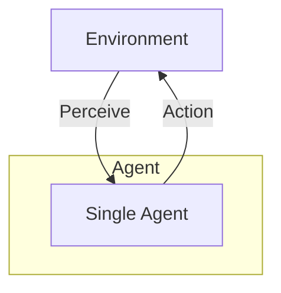
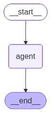
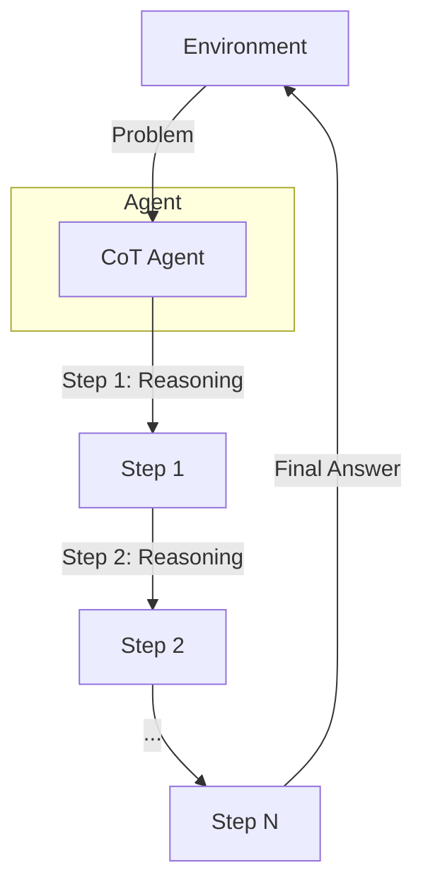
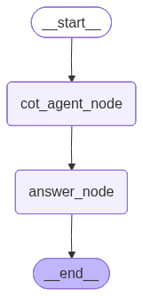

## Overview

This catalogue presents core architectural patterns for building intelligent, agentic AI systems. Each pattern addresses different trade‑offs across latency, cost, complexity, specialization, safety, and extensibility. Use this guide to (a) pick the minimal viable pattern for an initial prototype and (b) understand how to layer patterns together as requirements grow (e.g., start with a Single Agent, add Tool-Use for capability, then Memory/RAG for context persistence, introduce Reflection for quality, Router for specialization, Supervisor for scale, and Human‑in‑the‑Loop for risk control).

### Pattern Comparison Matrix

| Pattern | Primary Purpose | Typical Latency | Architectural Complexity | Relative Cost | Strengths | Watch Outs |
|---------|-----------------|-----------------|--------------------------|--------------|-----------|-----------|
| Single Agent | Direct responses | Low | Very Low | Low | Fast, simple | Limited scope, single failure point |
| Chain-of-Thought | Structured reasoning | Medium | Low | Medium | Explainability, better logic | Higher token usage |
| Tool-Using | Capability extension | Medium | Medium | Medium | Real-time data, accurate math | Tool selection & error handling |
| Memory / RAG | Context persistence & grounding | Medium | Medium | Medium | Personalization, reduced hallucination | Retrieval quality, storage/privacy |
| ReAct | Adaptive multi-step reasoning + action | High | Medium | High | Dynamic interaction, interpretable | Possible loops, cost |
| Human-in-the-Loop | Risk mitigation & compliance | Variable | Medium | High (human time) | Safety, auditability | Throughput bottleneck |
| Reflection | Self-quality improvement | High | Medium | High | Polished outputs, error reduction | Iteration overhead |
| Router | Intent-based specialization | Low–Medium | Medium | Optimizable | Domain specialization, resource efficiency | Misrouting risks |
| Supervisor (Hierarchical) | Complex task orchestration | High | High | High | Decomposition, parallelism | Coordination overhead |
---

## 1. Single Agent Pattern

A single autonomous agent perceives its environment, reasons, and takes actions to achieve specific goals.



### Use Cases
- **Customer FAQ automation**: Handling common questions about products, services, or policies
- **Personal productivity assistants**: Managing calendars, setting reminders, drafting emails
- **Content generation**: Creating social media posts, product descriptions, or blog drafts
- **Simple data entry and form filling**: Processing structured information without complex logic

### Advantages
- **Low latency**: Fast response times with minimal processing overhead
- **Cost-effective**: Requires fewer computational resources and API calls
- **Easy debugging**: Straightforward troubleshooting with single point of control
- **Quick deployment**: Minimal setup and configuration needed

### Limitations
- **Limited problem-solving scope**: Struggles with multi-step or multi-domain problems
- **No specialization**: Cannot leverage domain-specific expertise for different task types
- **Context window constraints**: May lose important context in long conversations
- **Single point of failure**: If the agent fails, the entire system stops

### LangGraph Example

```python
from langchain_openai import ChatOpenAI
from langgraph.graph import StateGraph, END
from typing import TypedDict

class AgentState(TypedDict):
    messages: list
    response: str

def agent_node(state: AgentState) -> AgentState:
    """Single agent that processes input and generates response"""
    llm = ChatOpenAI(model="gpt-5-mini")
    response = llm.invoke(state["messages"])
    return {"messages": state["messages"], "response": response.content}

# Build graph
workflow = StateGraph(AgentState)
workflow.add_node("agent", agent_node)
workflow.set_entry_point("agent")
workflow.add_edge("agent", END)

app = workflow.compile()

# Run
result = app.invoke({"messages": [{"role": "user", "content": "Hello!"}]})
print(result["response"])
```



```
Hi there! How can I help you today?
```

### Implementation Notes

- Separate short-term conversational context (recent message list) from long-term memory (vector store of summarized interactions or domain documents). Do not blindly append all raw messages to persistent storage.
- Consider a memory schema: `{timestamp, role, content, tags, importance_score}` to enable pruning and compliance filtering.
- Add an embedding-backed summarization step for every N messages to reduce token growth.
- Privacy: obtain explicit user consent before storing personally identifiable information. Encrypt sensitive memory at rest; define retention and deletion policy.
- Fall back gracefully when retrieval returns low-similarity results (e.g., require a minimum similarity threshold and proceed without augmentation if not met).

---

## 2. Chain-of-Thought (CoT) Pattern

Agent decomposes complex problems into step-by-step reasoning for improved accuracy and interpretability.



### Use Cases
- **Mathematical reasoning**: Solving algebra, calculus, and word problems step-by-step
- **Code debugging**: Breaking down error analysis into logical inspection steps
- **Legal document analysis**: Systematically reviewing contracts or regulations
- **Medical diagnosis support**: Following clinical reasoning pathways

### Advantages
- **Improved reasoning quality**: Forces systematic thinking and reduces logical errors
- **Explainability**: Each step can be inspected and validated by humans
- **Error identification**: Easy to pinpoint where reasoning went wrong
- **Better handling of edge cases**: Explicit reasoning catches overlooked scenarios

### Limitations
- **Higher token consumption**: Generates more text, increasing API costs
- **Latency issues**: Multiple reasoning steps add processing time
- **Prompt engineering complexity**: Requires well-crafted prompts for best results
- **Potential for verbose outputs**: Can generate unnecessarily long explanations

### LangGraph Example

```python
from langchain_openai import ChatOpenAI
from langgraph.graph import StateGraph, END
from typing import TypedDict, List
from IPython.display import Image, display


class CoTState(TypedDict):
    problem: str
    current_step: int
    reasoning_steps: List[str]
    final_answer: str

def cot_agent_node(state: CoTState) -> CoTState:
    """CoT Agent generates next reasoning step"""
    llm = ChatOpenAI(model="gpt-5-mini")
    current = state.get("current_step", 0)
    steps = state.get("reasoning_steps", [])
    
    if current == 0:
        # Generate all reasoning steps
        prompt = f"""Break down this problem into clear reasoning steps:
Problem: {state['problem']}

Provide 3-5 numbered reasoning steps."""
        response = llm.invoke(prompt)
        steps = [s.strip() for s in response.content.split('\n') if s.strip()]
        return {**state, "reasoning_steps": steps, "current_step": len(steps)}
    
    return state

def answer_node(state: CoTState) -> CoTState:
    """Generate final answer based on reasoning steps"""
    llm = ChatOpenAI(model="gpt-5-mini")
    steps_text = '\n'.join(state['reasoning_steps'])
    prompt = f"""Based on these reasoning steps, provide the final answer:
    
{steps_text}

Final Answer:"""
    
    response = llm.invoke(prompt)
    return {**state, "final_answer": response.content}

# Build graph - reflects sequential flow: Problem -> Agent -> Steps -> Answer
workflow = StateGraph(CoTState)
workflow.add_node("cot_agent_node", cot_agent_node)
workflow.add_node("answer_node", answer_node)
workflow.set_entry_point("cot_agent_node")
workflow.add_edge("cot_agent_node", "answer_node")
workflow.add_edge("answer_node", END)

app = workflow.compile()

# Run with a complex multi-step problem
complex_problem = """A train leaves Station A at 9:00 AM traveling at 60 mph. 
At 10:30 AM, it makes a 15-minute stop at Station B. After the stop, it continues 
at 75 mph for 2 hours. Then it slows down to 50 mph for the remaining 90 minutes 
until it reaches Station C. What is the average speed from Station A to Station C?"""

result = app.invoke({"problem": complex_problem})
print(f"Steps: {result['reasoning_steps']}")
print(f"Answer: {result['final_answer']}")

# Print the graph
display(Image(app.get_graph(xray=True).draw_mermaid_png()))
```



```
Steps: 
[
    '1) Compute distances for each moving segment: 9:00–10:30 is 1.5 h at 60 mph → 60×1.5 = 90 mi. After a 15-min (0.25 h) stop, it goes 2 h at 75 mph → 75×2 = 150 mi. Finally 1.5 h (90 min) at 50 mph → 50×1.5 = 75 mi.', 
    '2) Total distance = 90 + 150 + 75 = 315 miles.', 
    '3) Total time = travel times + stop = 1.5 + 0.25 + 2 + 1.5 = 5.25 hours.', 
    '4) Average speed = total distance / total time = 315 / 5.25 = 60 mph.'
]
Answer: Final answer: 60 mph.
```


### Implementation Notes

- Structured steps: ask for numbered steps and return as a JSON array for reliable parsing; separate reasoning from the final answer field.
- Verbosity control: cap steps (e.g., 3–5) and request “minimal sufficient steps” to manage tokens and latency.
- Determinism: set lower temperature for consistent reasoning; optionally enable a brief self-check before finalizing.
- Privacy: avoid logging raw chain-of-thought to analytics; store only summaries or conclusions.
- Guardrails: validate the final answer independently when possible (e.g., verify equations, run unit checks), not the rationale text.

---