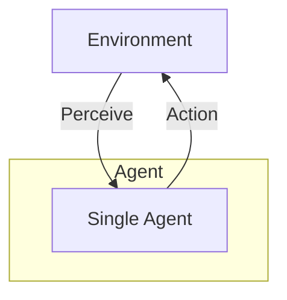
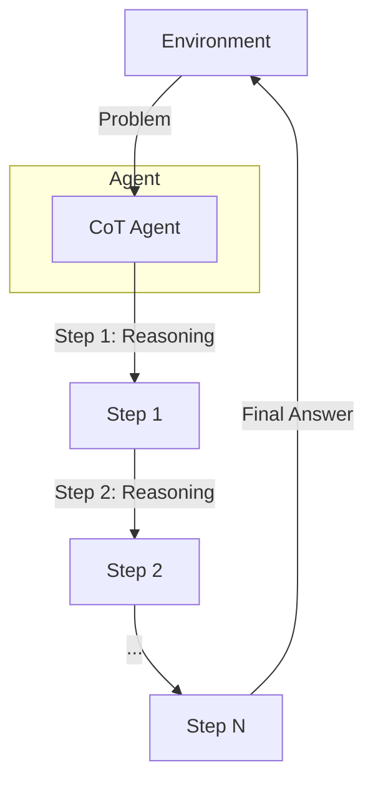
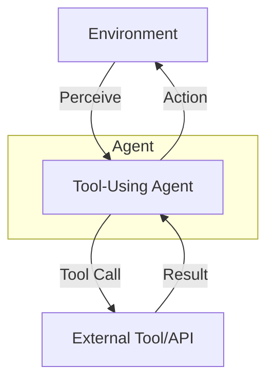
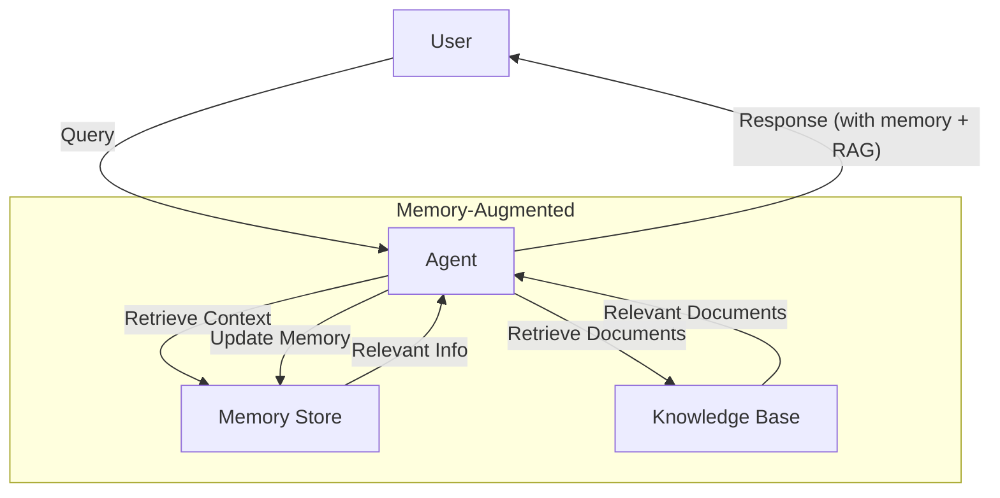
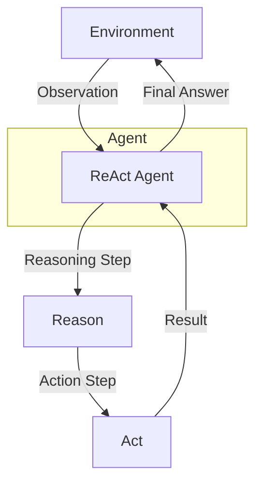
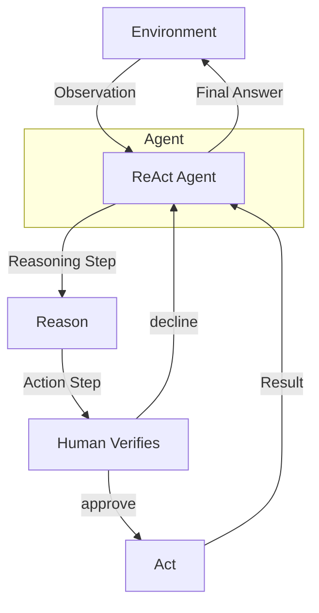
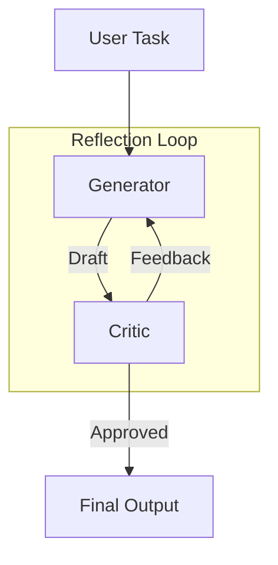
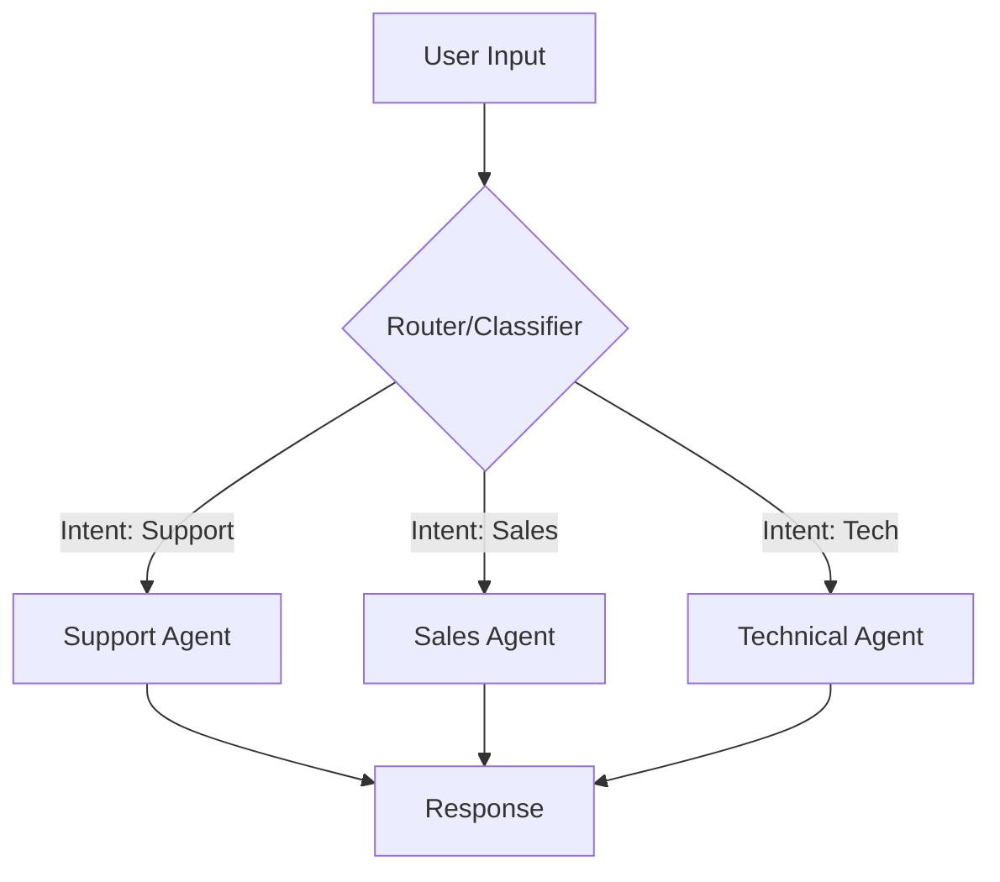
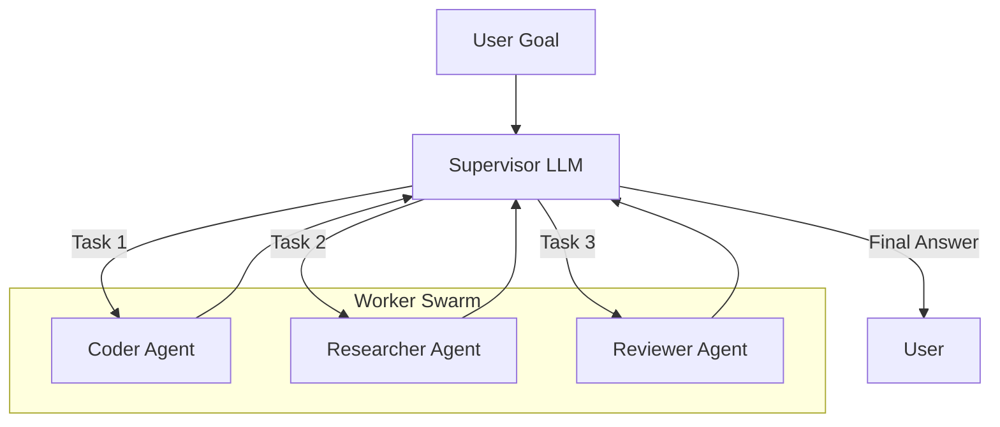

## 1. Single Agent Pattern

A single autonomous agent perceives its environment, reasons, and takes actions to achieve specific goals.



### Use Cases
- **Customer FAQ automation**: Handling common questions about products, services, or policies
- **Personal productivity assistants**: Managing calendars, setting reminders, drafting emails
- **Content generation**: Creating social media posts, product descriptions, or blog drafts
- **Simple data entry and form filling**: Processing structured information without complex logic

### Advantages
- **Low latency**: Fast response times with minimal processing overhead
- **Cost-effective**: Requires fewer computational resources and API calls
- **Easy debugging**: Straightforward troubleshooting with single point of control
- **Quick deployment**: Minimal setup and configuration needed

### Limitations
- **Limited problem-solving scope**: Struggles with multi-step or multi-domain problems
- **No specialization**: Cannot leverage domain-specific expertise for different task types
- **Context window constraints**: May lose important context in long conversations
- **Single point of failure**: If the agent fails, the entire system stops

### LangGraph Example

```python
from langchain_openai import ChatOpenAI
from langgraph.graph import StateGraph, END
from typing import TypedDict

class AgentState(TypedDict):
    messages: list
    response: str

def agent_node(state: AgentState) -> AgentState:
    """Single agent that processes input and generates response"""
    llm = ChatOpenAI(model="gpt-5-mini")
    response = llm.invoke(state["messages"])
    return {"messages": state["messages"], "response": response.content}

# Build graph
workflow = StateGraph(AgentState)
workflow.add_node("agent", agent_node)
workflow.set_entry_point("agent")
workflow.add_edge("agent", END)

app = workflow.compile()

# Run
result = app.invoke({"messages": [{"role": "user", "content": "Hello!"}]})
print(result["response"])
```

---

## 2. Chain-of-Thought (CoT) Pattern

Agent decomposes complex problems into step-by-step reasoning for improved accuracy and interpretability.



### Use Cases
- **Mathematical reasoning**: Solving algebra, calculus, and word problems step-by-step
- **Code debugging**: Breaking down error analysis into logical inspection steps
- **Legal document analysis**: Systematically reviewing contracts or regulations
- **Medical diagnosis support**: Following clinical reasoning pathways

### Advantages
- **Improved reasoning quality**: Forces systematic thinking and reduces logical errors
- **Explainability**: Each step can be inspected and validated by humans
- **Error identification**: Easy to pinpoint where reasoning went wrong
- **Better handling of edge cases**: Explicit reasoning catches overlooked scenarios

### Limitations
- **Higher token consumption**: Generates more text, increasing API costs
- **Latency issues**: Multiple reasoning steps add processing time
- **Prompt engineering complexity**: Requires well-crafted prompts for best results
- **Potential for verbose outputs**: Can generate unnecessarily long explanations

### LangGraph Example

```python
from langchain_openai import ChatOpenAI
from langgraph.graph import StateGraph, END
from typing import TypedDict, List

class CoTState(TypedDict):
    problem: str
    reasoning_steps: List[str]
    final_answer: str

def reasoning_step_node(state: CoTState) -> CoTState:
    """Generate reasoning steps"""
    llm = ChatOpenAI(model="gpt-5-mini")
    prompt = f"""Break down this problem into clear reasoning steps:
Problem: {state['problem']}

Provide 3-5 numbered reasoning steps."""
    
    response = llm.invoke(prompt)
    steps = response.content.split('\n')
    return {**state, "reasoning_steps": steps}

def answer_node(state: CoTState) -> CoTState:
    """Generate final answer based on reasoning"""
    llm = ChatOpenAI(model="gpt-5-mini")
    steps_text = '\n'.join(state['reasoning_steps'])
    prompt = f"""Based on these reasoning steps, provide the final answer:
    
{steps_text}

Final Answer:"""
    
    response = llm.invoke(prompt)
    return {**state, "final_answer": response.content}

# Build graph
workflow = StateGraph(CoTState)
workflow.add_node("reasoning", reasoning_step_node)
workflow.add_node("answer", answer_node)
workflow.set_entry_point("reasoning")
workflow.add_edge("reasoning", "answer")
workflow.add_edge("answer", END)

app = workflow.compile()

# Run
result = app.invoke({"problem": "If a train travels 60 mph for 2.5 hours, how far does it go?"})
print(f"Steps: {result['reasoning_steps']}")
print(f"Answer: {result['final_answer']}")
```

---

## 3. Tool-Using Agent Pattern

Agent extends capabilities by calling external tools, APIs, or services for specialized tasks.



### Use Cases
- **Data retrieval and analysis**: Querying databases, APIs, or data warehouses
- **Real-time information access**: Fetching weather, stock prices, or news updates
- **Mathematical computations**: Performing calculations beyond LLM capabilities
- **File system operations**: Reading, writing, or managing files and directories

### Advantages
- **Access to real-time data**: Can retrieve current information beyond training cutoff
- **Accurate computations**: Delegates math to specialized tools rather than approximating
- **Extensibility**: Easy to add new capabilities by integrating additional tools
- **Reduced hallucination**: Facts come from reliable external sources

### Limitations
- **Tool selection challenges**: Agent may choose wrong tool or use it incorrectly
- **Error handling overhead**: Must manage failures from external tools gracefully
- **Security concerns**: External tool access creates potential vulnerabilities
- **Latency from tool calls**: Network requests add delay to response times

### LangGraph Example

```python
from langchain_openai import ChatOpenAI
from langchain.tools import tool
from langgraph.graph import StateGraph, END
from langgraph.prebuilt import ToolNode
from typing import TypedDict, Annotated
import operator

@tool
def calculator(expression: str) -> str:
    """Evaluates a mathematical expression"""
    try:
        return str(eval(expression))
    except:
        return "Error in calculation"

@tool
def search(query: str) -> str:
    """Simulates web search"""
    return f"Search results for: {query}"

class ToolAgentState(TypedDict):
    messages: Annotated[list, operator.add]
    
def agent_node(state: ToolAgentState) -> ToolAgentState:
    """Agent decides whether to use tools"""
    llm = ChatOpenAI(model="gpt-5-mini").bind_tools([calculator, search])
    response = llm.invoke(state["messages"])
    return {"messages": [response]}

def should_continue(state: ToolAgentState) -> str:
    """Route to tools or end"""
    last_message = state["messages"][-1]
    if hasattr(last_message, 'tool_calls') and last_message.tool_calls:
        return "tools"
    return "end"

# Build graph
workflow = StateGraph(ToolAgentState)
workflow.add_node("agent", agent_node)
workflow.add_node("tools", ToolNode([calculator, search]))
workflow.set_entry_point("agent")
workflow.add_conditional_edges("agent", should_continue, {
    "tools": "tools",
    "end": END
})
workflow.add_edge("tools", "agent")

app = workflow.compile()

# Run
result = app.invoke({"messages": [{"role": "user", "content": "What is 25 * 47?"}]})
print(result["messages"][-1].content)
```

---

## 4. Memory-Augmented Agent Pattern (RAG)

Agent stores and retrieves information from past interactions and external knowledge bases for contextually relevant responses.



### Use Cases
- **Customer support with history**: Remembering past interactions and preferences
- **Personalized recommendations**: Using user history to suggest relevant content
- **Long-term conversational assistants**: Maintaining context across multiple sessions
- **Document question-answering**: Retrieving information from large document collections

### Advantages
- **Context continuity**: Maintains conversation flow across multiple interactions
- **Personalization**: Adapts responses based on user preferences and history
- **Grounded responses**: Information backed by retrieved documents reduces hallucination
- **Knowledge scalability**: Can access vast knowledge bases beyond context window limits

### Limitations
- **Retrieval quality dependency**: Poor retrieval leads to irrelevant or incorrect information
- **Memory storage costs**: Storing embeddings and documents requires infrastructure
- **Privacy and data governance**: Must manage sensitive information appropriately
- **Stale information**: Knowledge base can become outdated if not maintained

### LangGraph Example

```python
from langchain_openai import ChatOpenAI, OpenAIEmbeddings
from langchain_community.vectorstores import FAISS
from langchain.text_splitter import CharacterTextSplitter
from langgraph.graph import StateGraph, END
from typing import TypedDict, List

class RAGState(TypedDict):
    query: str
    retrieved_docs: List[str]
    response: str
    memory: List[dict]

# Setup vector store
documents = [
    "LangGraph is a library for building stateful agents.",
    "Agents can use tools to extend their capabilities.",
    "RAG combines retrieval with generation for better responses."
]
embeddings = OpenAIEmbeddings()
text_splitter = CharacterTextSplitter(chunk_size=100, chunk_overlap=0)
texts = text_splitter.create_documents(documents)
vectorstore = FAISS.from_documents(texts, embeddings)

def retrieve_node(state: RAGState) -> RAGState:
    """Retrieve relevant documents"""
    docs = vectorstore.similarity_search(state["query"], k=2)
    retrieved = [doc.page_content for doc in docs]
    return {**state, "retrieved_docs": retrieved}

def generate_node(state: RAGState) -> RAGState:
    """Generate response using retrieved context"""
    llm = ChatOpenAI(model="gpt-5-mini")
    context = "\n".join(state["retrieved_docs"])
    memory_context = "\n".join([f"{m['role']}: {m['content']}" for m in state.get("memory", [])])
    
    prompt = f"""Context from knowledge base:
{context}

Previous conversation:
{memory_context}

User query: {state['query']}

Provide a helpful response:"""
    
    response = llm.invoke(prompt)
    
    # Update memory
    new_memory = state.get("memory", [])
    new_memory.extend([
        {"role": "user", "content": state["query"]},
        {"role": "assistant", "content": response.content}
    ])
    
    return {**state, "response": response.content, "memory": new_memory}

# Build graph
workflow = StateGraph(RAGState)
workflow.add_node("retrieve", retrieve_node)
workflow.add_node("generate", generate_node)
workflow.set_entry_point("retrieve")
workflow.add_edge("retrieve", "generate")
workflow.add_edge("generate", END)

app = workflow.compile()

# Run
result = app.invoke({"query": "What is LangGraph?", "memory": []})
print(result["response"])
```

---

## 5. ReAct Pattern (Reason + Act)

Agent alternates between reasoning about the problem and taking actions, adapting based on observations.



### Use Cases
- **Research assistants**: Iteratively searching, reading, and synthesizing information
- **Troubleshooting and debugging**: Observing errors and taking corrective actions
- **Data science workflows**: Analyzing data, identifying issues, and adjusting approach
- **Interactive game agents**: Observing game state and deciding next moves

### Advantages
- **Dynamic adaptation**: Adjusts strategy based on intermediate observations
- **Interpretability**: Clear reasoning traces show decision-making process
- **Error recovery**: Can detect and correct mistakes during execution
- **Tool usage efficiency**: Only uses tools when reasoning determines they're needed

### Limitations
- **Higher computational cost**: Multiple LLM calls for reasoning and acting
- **Longer execution time**: Iterative process takes more time than direct approaches
- **State tracking complexity**: Must maintain detailed history of observations and actions
- **Potential for loops**: May get stuck repeating similar reasoning-action cycles

### LangGraph Example

```python
from langchain_openai import ChatOpenAI
from langchain.tools import tool
from langgraph.graph import StateGraph, END
from typing import TypedDict, List

@tool
def get_weather(location: str) -> str:
    """Get weather for a location"""
    return f"Weather in {location}: Sunny, 72°F"

@tool
def calculator(expression: str) -> str:
    """Calculate mathematical expression"""
    try:
        return str(eval(expression))
    except:
        return "Error"

class ReActState(TypedDict):
    input: str
    thought: str
    action: str
    observation: str
    steps: List[dict]
    final_answer: str

def reasoning_node(state: ReActState) -> ReActState:
    """Agent reasons about next action"""
    llm = ChatOpenAI(model="gpt-5-mini")
    
    steps_text = "\n".join([f"Step {i+1}: {s}" for i, s in enumerate(state.get("steps", []))])
    
    prompt = f"""Task: {state['input']}

Previous steps:
{steps_text}

What should you do next? Choose an action:
1. Use get_weather(location) to get weather
2. Use calculator(expression) to calculate
3. Provide final answer

Thought:"""
    
    response = llm.invoke(prompt)
    return {**state, "thought": response.content}

def action_node(state: ReActState) -> ReActState:
    """Execute action based on reasoning"""
    thought = state["thought"]
    
    # Simple parsing (in production, use structured output)
    if "get_weather" in thought.lower():
        observation = get_weather.invoke("San Francisco")
        action = "get_weather"
    elif "calculator" in thought.lower():
        observation = calculator.invoke("100 + 50")
        action = "calculator"
    else:
        return {**state, "final_answer": thought, "action": "answer"}
    
    steps = state.get("steps", [])
    steps.append({"thought": thought, "action": action, "observation": observation})
    
    return {**state, "observation": observation, "action": action, "steps": steps}

def should_continue(state: ReActState) -> str:
    """Decide if more steps needed"""
    if state.get("final_answer") or len(state.get("steps", [])) >= 3:
        return "end"
    return "continue"

# Build graph
workflow = StateGraph(ReActState)
workflow.add_node("reason", reasoning_node)
workflow.add_node("act", action_node)
workflow.set_entry_point("reason")
workflow.add_edge("reason", "act")
workflow.add_conditional_edges("act", should_continue, {
    "continue": "reason",
    "end": END
})

app = workflow.compile()

# Run
result = app.invoke({"input": "What's the weather in San Francisco?"})
print(f"Final: {result.get('final_answer', result['steps'][-1])}")
```

---

## 6. Human-in-the-Loop Pattern

Adds mandatory human validation before executing sensitive actions, ensuring safety and accuracy.



### Use Cases
- **Medical treatment recommendations**: Doctor reviews AI suggestions before prescribing
- **Financial trading decisions**: Human approval required for high-value transactions
- **Infrastructure deployments**: Engineer validates changes before production deployment
- **Content moderation**: Human review of borderline content flagged by AI

### Advantages
- **Risk mitigation**: Prevents costly or dangerous automated mistakes
- **Improved accuracy**: Human expertise catches edge cases AI might miss
- **Compliance and auditability**: Creates clear decision trail for regulatory requirements
- **User confidence**: People trust systems where they maintain control

### Limitations
- **Significant delays**: Waiting for human review slows down processes
- **Scalability bottleneck**: Human capacity limits throughput
- **Cost implications**: Human review time is expensive
- **Inconsistency**: Different humans may make different decisions

### LangGraph Example

```python
from langchain_openai import ChatOpenAI
from langgraph.graph import StateGraph, END
from langgraph.checkpoint.memory import MemorySaver
from typing import TypedDict

class HITLState(TypedDict):
    task: str
    proposed_action: str
    human_approved: bool
    result: str

def plan_action(state: HITLState) -> HITLState:
    """Agent proposes an action"""
    llm = ChatOpenAI(model="gpt-5-mini")
    prompt = f"Task: {state['task']}\n\nWhat action should be taken?"
    response = llm.invoke(prompt)
    return {**state, "proposed_action": response.content}

def human_approval(state: HITLState) -> HITLState:
    """Human reviews and approves action"""
    print(f"\n⚠️  HUMAN APPROVAL REQUIRED")
    print(f"Proposed action: {state['proposed_action']}")
    approval = input("Approve? (yes/no): ").lower() == "yes"
    return {**state, "human_approved": approval}

def execute_action(state: HITLState) -> HITLState:
    """Execute if approved"""
    if state["human_approved"]:
        result = f"✓ Executed: {state['proposed_action']}"
    else:
        result = "✗ Action rejected by human"
    return {**state, "result": result}

def check_approval(state: HITLState) -> str:
    """Route based on approval"""
    return "execute" if state["human_approved"] else "rejected"

# Build graph
workflow = StateGraph(HITLState)
workflow.add_node("plan", plan_action)
workflow.add_node("approval", human_approval)
workflow.add_node("execute", execute_action)
workflow.add_node("rejected", lambda s: {**s, "result": "Action cancelled"})

workflow.set_entry_point("plan")
workflow.add_edge("plan", "approval")
workflow.add_conditional_edges("approval", check_approval, {
    "execute": "execute",
    "rejected": "rejected"
})
workflow.add_edge("execute", END)
workflow.add_edge("rejected", END)

# Use memory to enable interrupts
memory = MemorySaver()
app = workflow.compile(checkpointer=memory, interrupt_before=["approval"])

# Run
config = {"configurable": {"thread_id": "1"}}
result = app.invoke({"task": "Delete production database"}, config)
print(result["result"])
```

---

## 7. Reflection Pattern (Self-Correction)

Agent critiques its own outputs through Generator and Critic roles to improve quality iteratively.



### Use Cases
- **Software development**: Writing code, reviewing for bugs, and refactoring
- **Content creation**: Drafting articles, critiquing quality, and revising
- **Report generation**: Creating business reports with quality checks
- **Resume and cover letter writing**: Iteratively improving professional documents

### Advantages
- **Improved output quality**: Multiple iterations refine and polish results
- **Error detection**: Self-critique catches mistakes before delivery
- **Consistency checking**: Ensures outputs meet specified requirements
- **No external reviewer needed**: Self-contained quality assurance

### Limitations
- **Multiple LLM calls**: Each iteration doubles or triples token usage and cost
- **Time-consuming**: Generate-critique cycles significantly increase response time
- **Convergence issues**: May struggle to reach "good enough" without clear criteria
- **Infinite loops**: Can get stuck in endless refinement cycles

### LangGraph Example

```python
from langchain_openai import ChatOpenAI
from langgraph.graph import StateGraph, END
from typing import TypedDict

class ReflectionState(TypedDict):
    task: str
    draft: str
    critique: str
    final_output: str
    iterations: int

def generator_node(state: ReflectionState) -> ReflectionState:
    """Generate or revise content"""
    llm = ChatOpenAI(model="gpt-5-mini")
    
    if state.get("critique"):
        prompt = f"""Task: {state['task']}
Previous draft: {state['draft']}
Critique: {state['critique']}

Revise the draft based on the critique:"""
    else:
        prompt = f"Task: {state['task']}\n\nGenerate content:"
    
    response = llm.invoke(prompt)
    iterations = state.get("iterations", 0) + 1
    return {**state, "draft": response.content, "iterations": iterations}

def critic_node(state: ReflectionState) -> ReflectionState:
    """Critique the generated content"""
    llm = ChatOpenAI(model="gpt-5-mini")
    
    prompt = f"""Review this content for the task: {state['task']}

Content:
{state['draft']}

Provide critique or say "APPROVED" if it meets all requirements:"""
    
    response = llm.invoke(prompt)
    return {**state, "critique": response.content}

def should_continue(state: ReflectionState) -> str:
    """Decide if more iterations needed"""
    if "APPROVED" in state["critique"].upper() or state["iterations"] >= 3:
        return "finalize"
    return "revise"

def finalize_node(state: ReflectionState) -> ReflectionState:
    """Finalize the output"""
    return {**state, "final_output": state["draft"]}

# Build graph
workflow = StateGraph(ReflectionState)
workflow.add_node("generator", generator_node)
workflow.add_node("critic", critic_node)
workflow.add_node("finalize", finalize_node)

workflow.set_entry_point("generator")
workflow.add_edge("generator", "critic")
workflow.add_conditional_edges("critic", should_continue, {
    "revise": "generator",
    "finalize": "finalize"
})
workflow.add_edge("finalize", END)

app = workflow.compile()

# Run
result = app.invoke({"task": "Write a Python function to calculate factorial"})
print(f"Iterations: {result['iterations']}")
print(f"Final: {result['final_output']}")
```

---

## 8. Router Pattern (Classifier)

Routes user queries to specialized agents based on intent classification for efficient processing.



### Use Cases
- **Customer support routing**: Directing queries to appropriate department agents
- **Multi-domain chatbots**: Routing to specialized agents for different topics
- **Enterprise knowledge systems**: Directing searches to relevant document repositories
- **Email classification**: Routing emails to correct teams or workflows

### Advantages
- **Modular architecture**: Each specialist agent can be developed independently
- **Resource optimization**: Route simple queries to cheaper, faster models
- **Specialist expertise**: Each agent optimized for specific domain
- **Easier debugging**: Issues isolated to specific agents or routing logic

### Limitations
- **Single point of failure**: Misrouting ruins user experience regardless of agent quality
- **Rigid category structure**: Difficult to handle queries spanning multiple domains
- **Cold start problem**: New categories require defining and training routing logic
- **Ambiguous queries**: Challenging to route when intent is unclear

### LangGraph Example

```python
from langchain_openai import ChatOpenAI
from langgraph.graph import StateGraph, END
from typing import TypedDict, Literal

class RouterState(TypedDict):
    query: str
    intent: str
    response: str

def router_node(state: RouterState) -> RouterState:
    """Classify intent"""
    llm = ChatOpenAI(model="gpt-5-mini")
    
    prompt = f"""Classify this query into one category:
- technical_support
- sales
- general

Query: {state['query']}

Category:"""
    
    response = llm.invoke(prompt)
    intent = response.content.strip().lower()
    return {**state, "intent": intent}

def technical_agent(state: RouterState) -> RouterState:
    """Handle technical queries"""
    response = f"[Technical Support] Handling: {state['query']}"
    return {**state, "response": response}

def sales_agent(state: RouterState) -> RouterState:
    """Handle sales queries"""
    response = f"[Sales Team] Handling: {state['query']}"
    return {**state, "response": response}

def general_agent(state: RouterState) -> RouterState:
    """Handle general queries"""
    response = f"[General Support] Handling: {state['query']}"
    return {**state, "response": response}

def route_query(state: RouterState) -> str:
    """Route to appropriate agent"""
    intent = state["intent"]
    if "technical" in intent:
        return "technical"
    elif "sales" in intent:
        return "sales"
    return "general"

# Build graph
workflow = StateGraph(RouterState)
workflow.add_node("router", router_node)
workflow.add_node("technical", technical_agent)
workflow.add_node("sales", sales_agent)
workflow.add_node("general", general_agent)

workflow.set_entry_point("router")
workflow.add_conditional_edges("router", route_query, {
    "technical": "technical",
    "sales": "sales",
    "general": "general"
})
workflow.add_edge("technical", END)
workflow.add_edge("sales", END)
workflow.add_edge("general", END)

app = workflow.compile()

# Run
result = app.invoke({"query": "My app keeps crashing"})
print(result["response"])
```

---

## 9. Supervisor Pattern (Hierarchical Orchestration)

Central supervisor LLM manages worker agents, delegating sub-tasks and aggregating results for complex goals.



### Use Cases
- **End-to-end software projects**: Coordinating design, coding, testing, and deployment
- **Comprehensive research reports**: Orchestrating data gathering, analysis, and writing
- **Multi-step data pipelines**: Managing extraction, transformation, and loading workflows
- **Product development**: Coordinating market research, design, and prototyping

### Advantages
- **Task decomposition**: Breaks complex problems into manageable sub-tasks
- **Parallel execution**: Workers can operate simultaneously on different sub-tasks
- **Specialist optimization**: Each worker uses best model/tools for their domain
- **Flexible orchestration**: Supervisor adapts plan based on intermediate results

### Limitations
- **Supervisory overhead**: Central planning adds latency to every task
- **Expensive operations**: Multiple LLM calls for supervisor and workers increase costs
- **Planning complexity**: Supervisor must accurately decompose and delegate tasks
- **Communication bottleneck**: All coordination flows through supervisor agent

### LangGraph Example

```python
from langchain_openai import ChatOpenAI
from langgraph.graph import StateGraph, END
from typing import TypedDict, List, Literal

class SupervisorState(TypedDict):
    task: str
    plan: List[str]
    results: dict
    final_output: str
    next_worker: str

def supervisor_node(state: SupervisorState) -> SupervisorState:
    """Supervisor plans and delegates"""
    llm = ChatOpenAI(model="gpt-5-mini")
    
    if not state.get("plan"):
        # Initial planning
        prompt = f"""Task: {state['task']}

Create a plan with 3 sub-tasks for: researcher, coder, reviewer
Format as numbered list:"""
        response = llm.invoke(prompt)
        plan = response.content.split('\n')
        return {**state, "plan": plan, "next_worker": "researcher"}
    
    # Check results and decide next step
    if len(state["results"]) < 3:
        workers = ["researcher", "coder", "reviewer"]
        next_worker = workers[len(state["results"])]
        return {**state, "next_worker": next_worker}
    
    # All done, aggregate
    llm = ChatOpenAI(model="gpt-5-mini")
    results_text = "\n".join([f"{k}: {v}" for k, v in state["results"].items()])
    prompt = f"""Combine these results into final output:

{results_text}

Final output:"""
    response = llm.invoke(prompt)
    return {**state, "final_output": response.content, "next_worker": "FINISH"}

def researcher_node(state: SupervisorState) -> SupervisorState:
    """Research worker"""
    result = f"Research completed: Found relevant information about {state['task']}"
    results = state.get("results", {})
    results["researcher"] = result
    return {**state, "results": results}

def coder_node(state: SupervisorState) -> SupervisorState:
    """Coder worker"""
    result = f"Code written: Implemented solution for {state['task']}"
    results = state.get("results", {})
    results["coder"] = result
    return {**state, "results": results}

def reviewer_node(state: SupervisorState) -> SupervisorState:
    """Reviewer worker"""
    result = f"Review done: Solution meets requirements"
    results = state.get("results", {})
    results["reviewer"] = result
    return {**state, "results": results}

def route_to_worker(state: SupervisorState) -> str:
    """Route to next worker or finish"""
    return state.get("next_worker", "FINISH")

# Build graph
workflow = StateGraph(SupervisorState)
workflow.add_node("supervisor", supervisor_node)
workflow.add_node("researcher", researcher_node)
workflow.add_node("coder", coder_node)
workflow.add_node("reviewer", reviewer_node)

workflow.set_entry_point("supervisor")
workflow.add_conditional_edges("supervisor", route_to_worker, {
    "researcher": "researcher",
    "coder": "coder",
    "reviewer": "reviewer",
    "FINISH": END
})
workflow.add_edge("researcher", "supervisor")
workflow.add_edge("coder", "supervisor")
workflow.add_edge("reviewer", "supervisor")

app = workflow.compile()

# Run
result = app.invoke({"task": "Build a web scraper for news articles"})
print(f"Plan: {result['plan']}")
print(f"Results: {result['results']}")
print(f"Final: {result['final_output']}")
```

## References

- [Agent Patterns from AWS](https://docs.aws.amazon.com/prescriptive-guidance/latest/agentic-ai-patterns/agent-patterns.html)
- [Agent system design patterns from Databricks](https://docs.databricks.com/aws/en/generative-ai/guide/agent-system-design-patterns)
- [AI agent orchestration patterns from Microsoft](https://learn.microsoft.com/en-us/azure/architecture/ai-ml/guide/ai-agent-design-patterns)
- [Agent Design Pattern Catalogue from Arxiv](https://arxiv.org/pdf/2405.10467)
- [Agent Patterns with LangGraph and LangChain](https://agent-patterns.readthedocs.io/en/latest/)
