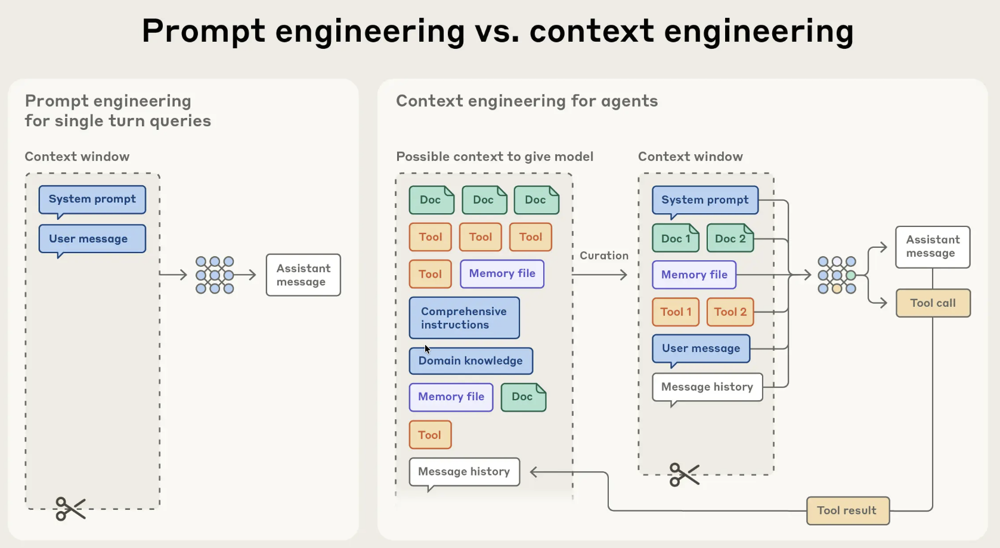

As LLMs grow in capability, the challenge is shifting from model intelligence to state management. Complex workflows, such as deep research, can take hours to execute, involving numerous tool calls and the processing of massive files. In these scenarios, the context window often becomes a bottleneck.

This article explores context engineering - what it is, how it differs from prompt engineering, common problems and pitfalls, and the core strategies required to build production-grade agents.

## What is Context Engineering
Context Engineering is the art and science of dynamically managing the context window to ensure an AI agent has exactly the information it needs to perform its next step. Agentic workflows generate an unbounded explosion of messages, including tool calls, error logs, and massive JSON objects appended to the history.

Models suffer from **"context rot"** - where reasoning capabilities degrade, latency spikes, and hallucinations occur as the context grows. Like humans, LLMs have a limited **"attention budget"**. Every new token introduced depletes this budget, increasing the need to carefully curate the tokens available to the model. Context Engineering is the system architecture designed to combat this challenge.

## Context Engineering vs Prompt Engineering

**Prompt Engineering**: Emerged around 2022 with ChatGPT. It focuses on optimizing static instructions (the "System Prompt") or crafting the perfect single-turn query. It is about **instruction optimization**.

**Context Engineering**: Emerged significantly in 2025. It focuses on the lifecycle of information over hundreds of turns. It deals with flow, memory management, and state persistence. It is about **information architecture**.

## The Anatomy of Effective Context
To manage the finite attention budget, you must find the smallest set of high-signal tokens.

*   **System Prompts**: Aim for the "Goldilocks zone" of altitude - specific enough to guide behavior but flexible enough to allow the model to use its own heuristics. Avoid hardcoding brittle logic.
*   **Tools**: Tools define the contract between agents and their environment. They should be token-efficient and self-contained. If a human engineer can't definitively say which tool to use, the agent won't either. Avoid bloated toolsets.
*   **Examples**: Instead of a laundry list of edge cases, curate a set of diverse, canonical examples (few-shot prompting) that effectively portray the expected behavior.

## Common Problems & Pitfalls
**The Context Explosion**: Agents naturally accumulate tool outputs. If an agent searches the web and scrapes a site, dumping that raw HTML into the context window wastes tokens and distracts the model.

**Tool Confusion**: When developers stuff too many tools into the function calling definitions, the model forgets which tools exist or how to use them.

**The Fine-Tuning Trap**: Many try to fine-tune models early to fix performance issues. It is better to rely on general models and better context management until you have absolute use case fit.

**Over-Engineering**: Using complex vector databases and semantic search for short-lived agent sessions is often unnecessary. Simple file-system tools (like grep or glob) are often faster and more reliable for temporary context.

## Core Strategies

### 1. Just-in-Time Context (Context Offloading)
Instead of pre-processing all relevant data, agents should maintain lightweight identifiers (file paths, stored queries) and load data dynamically.
*   **Progressive Disclosure**: Allow agents to discover context layer by layer (e.g., listing files first, then reading specific ones).
*   **Hybrid Strategy**: Retrieve some critical data up front for speed, but rely on autonomous exploration (using tools like `grep` or `ls`) for depth.

### 2. Context Reduction & Compaction
*   **Compaction**: When the context limit nears, summarize the conversation history. Keep critical details (architectural decisions, unresolved bugs) but discard redundant tool outputs.
*   **Tool Result Clearing**: A lightweight form of compaction. Once a tool has been used and the result processed, the raw output (e.g., a massive JSON blob) is often no longer needed and can be removed or summarized.

### 3. Structured Note-Taking (Agentic Memory)
Agents should regularly write notes to persistent memory outside the context window (e.g., a `NOTES.md` file or a "scratchpad").
*   This allows the agent to track progress, dependencies, and "to-do" items across context resets.
*   It enables long-horizon tasks that span hours, as the agent can "read" its own memory to restore state.

### 4. Context Isolation
*   **Delegation**: For distinct tasks (e.g., "Find this code snippet"), spin up a sub-agent with a fresh context window. Give it instructions, let it work, and accept only the final answer.
*   **Sharing Memory**: Only share the full context history with sub-agents if the task absolutely requires understanding the full nuance of previous actions.

## Takeaway
The biggest improvements in agent reliability often don't come from adding complex retrieval systems, but from ***simplifying***. By keeping the context window clean, you allow the model to focus its ***intelligence*** on reasoning rather than memory management.

## References
* [Effective context engineering for AI agents from Anthropic](https://www.anthropic.com/engineering/effective-context-engineering-for-ai-agents)
* [Context Engineering for Agents from LangChain](https://blog.langchain.com/context-engineering-for-agents/)