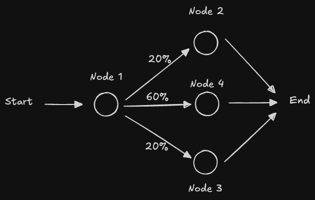

## Fundamentals of Agents

### Agents and LangGraph

Agents come in many different forms, each with varying levels of autonomy and control. Understanding these distinctions is crucial for building effective AI systems.


**Chain** is a set of steps before and after an LLM call. It's very reliable, with the same control flow every time, making it predictable and easy to debug.

**Router Agents** represent a type with low-level control. As shown in the diagram above, a router agent has a limited set of predefined options (e.g., choosing between step 2 or step 3) that the LLM can select from. The decision-making is constrained to these specific pathways, providing more predictable behavior.

**Autonomous Agents**, in contrast, operate with greater flexibility. They can navigate through any sequence of steps from a given set of options, or even dynamically generate their own next actions based on available resources and context. This autonomy allows for more adaptive behavior but also requires more sophisticated orchestration.

**LangGraph** is designed to help you build agents that balance reliability with control. The pillars of LangGraph include persistence, streaming, human-in-the-loop, and controllability. 


### LangGraph Key Components

**State** is a shared data structure that represents the current snapshot of your application. It's an object that gets passed between nodes and edges of the graph. It can be any data type, but is typically defined using a shared state schema.

**Nodes** are functions that encode the logic of agents. They receive the current state as input, perform logic operations, and return an updated state.

**Edges** are functions that determine which node to execute next based on the current state. They can be conditional branches or fixed transitions.

**State** holds the shared data, **nodes** perform the work by updating the state, and **edges** determine what to do next based on the state.


### A Simple Graph Example

Below is a simple graph example using LangGraph. It has 3 nodes and one conditional edge.



#### Installation

First, install the required dependencies:

```bash
pip install --quiet -U langgraph
```

#### Code Implementation

#### Imports

```python
from typing_extensions import TypedDict
from typing import Literal
import random
from langgraph.graph import StateGraph, START, END
from IPython.display import Image, display
```

#### State Definition

The State schema serves as the input schema for all nodes and edges in the graph. We use `TypedDict`, which provides type hints for the keys.

```python
class State(TypedDict):
    graph_state: str
```

**Key Points:**
- The state is a `TypedDict` that defines the structure of data flowing through the graph
- All nodes can access and modify the state
- The state is passed as the first argument to each node function

#### Node Functions

Nodes are Python functions that process the state. Each node:
- Receives the current state as the first positional argument
- Can access state keys using dictionary syntax: `state['graph_state']`
- Returns a dictionary with updated state values
- By default, returned values override the prior state

```python
def node_1(state):
    """First node that adds ' I am' to the graph state."""
    print("---Node 1---")
    return {"graph_state": state['graph_state'] + " I am"}


def node_2(state):
    """Second node that adds ' happy!' to the graph state."""
    print("---Node 2---")
    return {"graph_state": state['graph_state'] + " happy!"}


def node_3(state):
    """Third node that adds ' sad!' to the graph state."""
    print("---Node 3---")
    return {"graph_state": state['graph_state'] + " sad!"}


def node_4(state):
    """Fourth node that adds ' Indifferent!' to the graph state."""
    print("---Node 4---")
    return {"graph_state": state['graph_state'] + " Indifferent!"}
```

#### Edge Functions

Edges connect nodes in the graph:

- **Normal Edges**: Always route from one node to another (e.g., `node_1` → `node_2`)
- **Conditional Edges**: Optionally route between nodes based on logic

Conditional edges are implemented as functions that return the next node to visit based on the current state.

```python
def decide_mood(state) -> Literal["node_2", "node_3", "node_4"]:
    """
    Conditional edge function that decides which node to visit next.
    
    Routing probabilities:
    - 20% → node_2 (happy)
    - 60% → node_4 (indifferent)
    - 20% → node_3 (sad)
    """
    user_input = state['graph_state']
    
    # Random decision logic
    if random.random() < 0.2:
        return "node_2"  # 20% chance
    elif random.random() < 0.8:
        return "node_4"  # 60% chance
    else:
        return "node_3"  # 20% chance
```

**Note:** In a real application, you would typically use the state content to make routing decisions rather than random selection. For example, you might analyze the text content or use an LLM to determine the appropriate next step.

#### Graph Construction

Build the graph by:
1. Initializing a `StateGraph` with the `State` class
2. Adding nodes to the graph
3. Adding edges (normal and conditional)
4. Compiling the graph to validate its structure

```python
# Initialize the graph builder
builder = StateGraph(State)

# Add all nodes
builder.add_node("node_1", node_1)
builder.add_node("node_2", node_2)
builder.add_node("node_3", node_3)
builder.add_node("node_4", node_4)

# Entry point
builder.add_edge(START, "node_1")

# Conditional routing
builder.add_conditional_edges("node_1", decide_mood)

# Exit points
builder.add_edge("node_2", END)
builder.add_edge("node_3", END)
builder.add_edge("node_4", END)

# Compile the graph (performs validation)
graph = builder.compile()
```

You can view the graph by running the command below:

```python
display(Image(graph.get_graph().draw_mermaid_png()))
```


#### Graph Execution

Now we can invoke the graph:

```python
result = graph.invoke({"graph_state": "Hi, this is Gen."})
print(result)
```

The result below shows the execution path through node 1 and node 4:

```
---Node 1---
---Node 4---
{'graph_state': 'Hi, this is Gen. I am Indifferent!'}
```