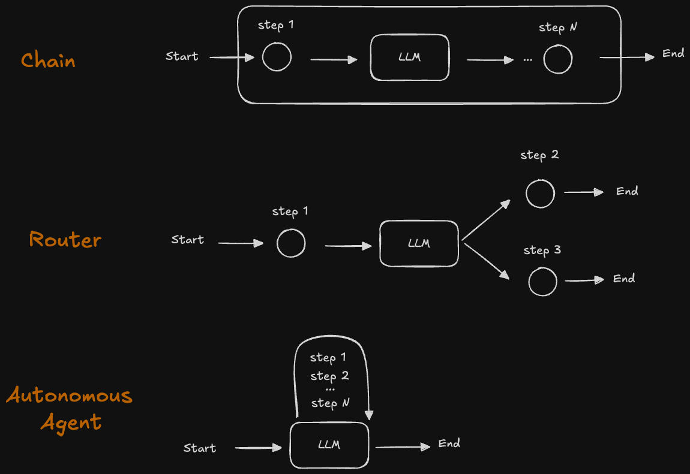

## Fundamentals of Agents

### How Agents Work

Agents come in many different forms, each with varying levels of autonomy and control. Understanding these distinctions is crucial for building effective AI systems.

**Router Agents** represent a type with low-level control. As shown in the diagram above, a router agent has a limited set of predefined options (e.g., choosing between step 2 or step 3) that the LLM can select from. The decision-making is constrained to these specific pathways.

**Autonomous Agents**, in contrast, operate with greater flexibility. They can navigate through any sequence of steps from a given set of options, or even dynamically generate their own next actions based on available resources and context. This autonomy allows for more adaptive behavior but also requires more sophisticated orchestration.

**LangGraph** is aimed to help you build agents balance reliability with control.  

### Common Agent Architectures & Challenges
### Custom Agents with LangGraph

## State and Memory

## Build you own assistant